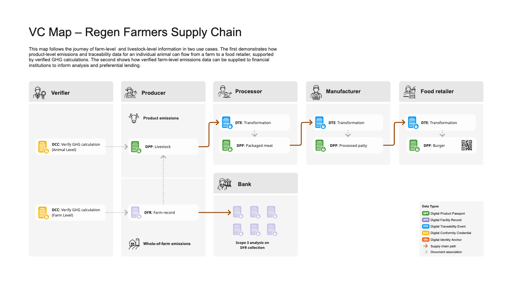

# AATP interactive VC map 

## How trusted data flows through the supply chain – from paddock to plate

 

The Australian Agriculture Transparency Protocol (AATP) helps track and prove sustainability claims as products move through the supply chain. It does this using **digital credentials**—secure, verifiable data records that tell the story of a product and who vouches for it.

Here are the k¬ey types of credentials used:
- **Digital Facility Record (DFR)** – Describes a physical site like a farm or processing facility, including who owns it and whether it meets certain standards.
- **Digital Conformity Credential (DCC)** – A credential issued by a third party (such as a verifier) to confirm that specific claims (e.g. emissions, certifications) are backed by data.
- **Digital Product Passport (DPP)** – A digital summary of the journey of an individual product or batch, including links to relevant DFRs and DCCs.
- **Digital Transformation Event (DTE)** – Describes how a product was processed or changed at a certain point in the supply chain.

These credentials link together to form a **trust graph** – a visual map of who said what, based on what evidence.

Now, let’s follow a hamburger patty on its journey through the supply chain:

## Verifier
A company like **Regen Farmers Mutual** works with farmers to measure the greenhouse gas (GHG) emissions at their property and for individual animals. Based on the data supplied by the farmer, they issue a **Digital Conformity Credential (DCC)** that confirms the emissions calculations.

## Producer (Livestock Farmer)
The farmer creates a **Digital Facility Record (DFR)** for their farm and attaches the Farm-Level GHG DCC. They then create a **Digital Product Passport (DPP)** for each animal going to processing, attaching the Animal-Level GHG DCC and linking the farm’s DFR. The DPP includes emissions data for that specific animal and is sent with the animal (and the invoice) to the processor. The DFR may also be used to apply for green finance.

## Processor
When the processor receives the animals, they also receive the corresponding DPPs, matched to ear tags. They create a **Digital Transformation Event (DTE)** to describe how and where the animal was processed. This is linked to a new DPP for the packaged meat, which includes a QR code printed on the label.

## Manufacturer
The manufacturer scans the meat package to retrieve the DPP. They then create a DTE to describe how the meat was turned into burger patties. A new DPP is created for each batch of patties, with a QR code for retailers to use.

## Food Retailer
When the patties arrive, the retailer scans the QR code and creates a final DTE that describes the creation of the finished hamburgers. Each hamburger has a QR code on its box linking to a **generic DPP**, while the receipt may include a code for a **specific DPP** that corresponds to the exact burger the consumer purchased.

## Consumer
The shopper can scan the QR code with their phone to view the sustainability credentials behind their burger – seeing which farm it came from, its emissions profile, and the journey it took.

## Financial Institution
Banks and lenders can analyse the DFRs and DCCs over time to identify farms with strong environmental performance – and offer them preferential rates on green loans.

## Explore the system
An **interactive VC map** shows how these credentials connect, helping build trust from the paddock to the plate.

[Explore the interactive VC Map here.](https://www.regen.pyx.io/regen-vc-map)
